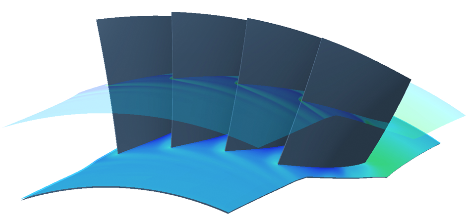
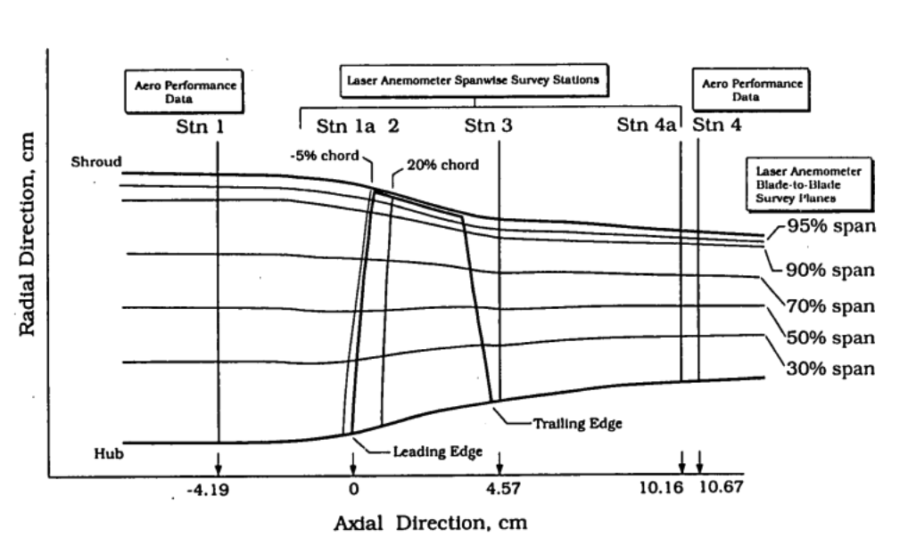

# NASA Rotor37 Aerodynamic Dataset
Transonic high pressure compressor blade row, part of an 8-stages compressor, aerodynamic database.

## Blade Parametrization
For the generation of the blade, we use a multisection parameterization. Each section is defined by camber line and thickness distribution on the m,𝑅𝜃 construction plane. The geometry is defined by three sections: hub, shroud and mid-span. For each camber line, according to the parameterization adopted, we have the following EDPs:

- chord length;
- inlet/Exit metal angle;
- leading/Trailing edge wedge angle;
- stagger angle.

Each section has a thickness law defined by a Bezier curve
with 8 control points, of which only the 4 central points are freely editable. Blade meridional and tangential stacking is controlled by two Bezier curves with 3 control points each , with a total of 36 degrees of freedom.

A RANS approach with two-equation SST (Shear Stress Transport) model is adopted for the turbulence closure, a proper near wall refinement is imposed to obtain 𝑦+ ≈ 1. As boundary conditions (following table), the total quantities (pressure and temperature), flow angles distribution and turbulent quantities are defined at inlet while, at the outlet section, a static pressure distribution with radial equilibrium and backflow control is imposed.

| **Inlet**      | **Outlet**         |
|----------------|--------------------|
| Vr/\|V\| = 0   | Radial Equilibrium |
| Vt/\|V\| = 0   | Ps = 90000 Pa      |
| Vz/\|V\| = 1   | R = 0.215          |
| Pt = 101800 Pa |                    |
| Tt = 288 Pa    |                    |

## Database Generation
For the Rotor37 database generation, the Latinized Centroidal Voronoi Tessellations (LCVT) technique is adopted. A total of 2000 simulations are performed. None of these simulations failed according to convergence criteria set. Each simulation is performed in parallel on 10 CPU cores.
## Data Structure
### Geometries

Geometries are provided in the form of point clouds. The blades are described by 9 sections. The data are provided in the form of numpy arrays.

 * All the samples have the same number of points-per-section and same number of sections
 * Data are not normalized
 * 2000 Samples
 * Every geometry is splitted in pressure side and suction side
 * 112 points for pressure side / suction side
 * 9 sections-per-sample 
 * 4 dimensions (x, y, z, label)

**Dataset shape: (2000, 2, 9, 112, 4)**
(samples, surfaces, sections, points, dimensions)

surfaces labels:
-  0: suction side
- 1: pressure side

dimensions: 
- x
- y
- z
- label 

label
- 0: suction side
- 1: pressure side

### EDPs and Performances
Tabular structured data for the 2000 simulations conducted are provided. The data contains 36 design parameters (Engineering Design Parameters) used for the generation of the dataset and 17 aerodynamic performances obtained through CFD simulation.

## Articles and researches using this data
- [Rotor37 Aerodynamic Optimization: A Machine Learning Approach](https://asmedigitalcollection.asme.org/GT/proceedings-abstract/GT2022/86120/V10DT34A021/1149434
)

## Contacts
- Marco Sanguineti - marco.sanguineti@deeplabs.it

